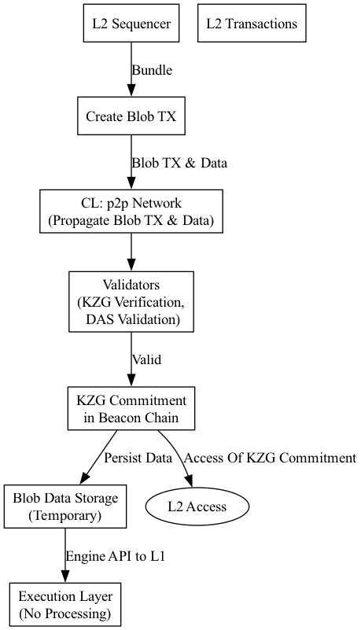

# Oscar

1. A eco-lifelong learner. To surf🏄‍♀️ better in the Web3 world. Enjoy this challenging vibe and become cooler 🆒. TG：lessaremore
2. 你认为你会完成本次残酷学习吗？ Yes. 

## Notes

<!-- Content_START -->
### 2025.02.06
**学习主题：此次共学内容 EPF 背景，及内容方向**
学习了解 https://epf.wiki/ ，initiated by EF Protocol Support and maintained by EPFsg community. 主要搞清楚EF、EPF、EPFsg community 间关系。
- EPFsg has been designed to guide and grow the next generation of Ethereum core developers and provide a deep understanding of Ethereum's internal mechanics. 
- EPF Wiki 是一个关于以太坊协议的技术资源中心。focused on a general overview of the underlying structure of Ethereum. 此 Wiki 的范围仅限于以太坊核心协议基础设施的技术资源。

EPF 学习小组是一个实时网络研讨会式项目，由两个阶段组成。
- 第一阶段，每周将有一节 90 分钟的课程，重点介绍以太坊底层结构的一般概述。
- 在后期阶段，学生将选择研究或开发方向（或两者）。深入研究的主题包括：
  - Protocol design 
  - Execution and Consensus layer architecture, specs, and implementations 执行和共识层架构、规范和实现
  - Testing methods and tools 
  - Current research and roadmap items: 当前的研究和路线图项目
    - Verkle trees
    - Sharding
    - MEV
    - Proof of stake improvements
    - State and history expiry

### 2025.02.07
**学习了解 ETH 早期历史：**
- 根植于早期互联网的开放精神，并受到几个关键运动和技术的影响。它从 Unix 的简洁性和模块化设计理念、GNU/Linux 所体现的自由和开源运动以及密码朋克所倡导的密码学进步中汲取灵感。

- 互联网本身起源于 ARPANET，它连接了世界，打破了地域障碍，实现了前所未有的互动。 Unix 及其 C 语言为软件设计提供了基本原则，强调简洁性和可重用性。 出于对安全通信的需求而诞生的公钥密码学为无需信任的系统铺平了道路。 

- 由 Richard Stallman 和 GNU 项目领导的自由软件运动强调自由高于价格，从而产生了 GNU/Linux 操作系统。 这凸显了协作式、社区驱动的软件开发的强大力量。

- 密码朋克寻求一种密码学上安全的数字货币，从而促成了 DigiCash、B-money 和 BitGold 等尝试。 虽然这些努力没有成功，但它们为比特币的设计提供了信息。 

👍 比特币也是世界上有史以来`最大的社会经济实验`。==中本聪于 2009 年 1 月首次启动比特币区块链时，他同时引入了两个激进且未经测试的概念==。 第一个是“比特币”，一种去中心化的点对点在线货币，无需任何支持、内在价值或中央发行机构即可维持价值。 另一个同样重要的部分是：基于工作量证明的区块链的概念，以允许公众对交易顺序达成一致。
- 中本聪的比特币引入了一种去中心化的点对点电子现金系统，但其在应用程序开发方面的局限性导致了以太坊的出现。

- Bitcoin Magazine 的联合创始人 Vitalik Buterin 认识到比特币的局限性，并提出了一个更通用的平台。 在 Gavin Wood 的帮助下，以太坊的设计得以正式确定，并于 `2015 年 7 月 30` 启动，旨在构建一个自主的数字经济。On July 30, 2015, Ethereum went live as a platform aimed at building tools for a self-sovereign economy using digital currency. 其目标是构建一个无国界、自我主权的数字经济生态。

### 2025.02.08
**学习了解 ETH 协议架构 epf.wiki/#/wiki/protocol/architecture**

**协议发展与目前构架：**
- 当前的协议架构是多年发展的成果。该协议由两个主要部分组成 - 执行层和共识层。
- 执行层 (EL) 处理实际的交易和用户交互，它是 the global computer 执行其程序的地方。
- 共识层 (CL) 提供权益证明共识机制 - 一种 cryptoeconomic security ，确保所有节点遵循相同的提示并驱动执行层的规范链。
- 在实践中，这些层是在其自己的客户端中实现的，这些客户端通过 API 连接。每个都有自己的 p2p 网络来处理不同类型的数据。

**分析：**
- 图显示了以太坊的模块化架构，将共识（就状态达成一致）与执行（运行智能合约和处理交易）的关注点分开，并允许将来的升级和可伸缩性改进。
- Engine API 充当桥梁，使两层可以协同工作以维护安全且一致的区块链。

**扩展学习：Blobs**
- 一种“半链下”解决方案，可在成本效率和数据安全性/可用性之间取得平衡。虽然 blobs 不是以与交易数据或状态数据相同的方式直接存储在以太坊区块链上，但它们是由以太坊网络管理和保证的。
- 在 AI 辅助下梳理 Blobs workflow 图：仅供参考
- 
  

### 2025.02.09

**学习主题：Protocol Design Philosophy**
五个核心原则及其具体指导：
* Simplicity 简洁
    * Managing Complexity (sandwich model complexity & encapsulated complexity)
* Universality 通用基础
    * Generalization
    * We have no features 

* Modularity 模块
* Non-discrimination 无歧视性
    * Freedom 类似中立性
* Agility 敏捷

### 2025.02.10

**学习主题：Blockchain level protocol**
- Accounts over UTXOs 跟踪区块链上谁拥有什么代币的不同方式
- Merkle Patricia Trie (MPT)  vs Verkle trees 以太坊如何以高效且可验证的方式存储数据。
  - Verkle 树有可能在未来取代 MPT。 它们旨在实现更小的“证明大小”，这对于使以太坊更具可扩展性并使轻客户端更容易使用至关重要。
  - 目标是迁移到“无状态”客户端，这些客户端不需要存储整个以太坊状态。
- RLP / SSZ 以一致且有效的方式编码数据以进行存储和传输的方式。
  -  SSZ 解决了 RLP 无法高效支持 Merkle 化的缺点，为无状态客户端的实现提供了支持。
- In Ethereum's proof-of-stake based consensus mechanisms, finality refers to the guarantee that a block cannot be altered or removed from the blockchain without burning at least 33% of the total staked ETH. 
  - 了解 33 % 的原因：在以太坊的权益证明 (PoS) 系统中，选择 33% 作为最终性的阈值，特别是在 Casper FFG 的背景下，这是一个根植于拜占庭容错 (BFT) 理论的设计决策。
  - Pos 核心共识：Casper FFG / LMD-GHOST ：确保对区块链状态达成一致并防止攻击。
    - Casper FFG 通过叠加在区块提议机制之上的方式运行，通过投票选择代表规范交易账本的唯一链，并通过 Slashing 机制来惩罚恶意行为。
    - 在 PoS 中，LMD-GHOST 依靠验证者对区块的投票来选择。
- Using a DHT 一种在以太坊网络上查找其他节点（对等节点）的方法。
  - Nonce： 防止帐户模型（以太坊的数据结构方式）中的重放攻击。
  - Hash： 确保数据完整性、将区块链中的区块链接在一起以及保护整个系统。

### 2025.02.11

**学习主题：Evolution**
以太坊的核心架构和历史演变:
- Frontier (2015-07-30): Beta Release, Dev Focus
- Homestead (2016-03-14): EIP-2 Fixes、EIP-7 DELEGATECALL、EIP-8 Forward Compat.
- The Merge (2022-09-15): EIP-3675, PoS Transition

理解从 PoW 到 PoS（其中信标链充当以太坊的“共识提供者”）的转变。

### 2025.02.12
**学习主题：Consensus Layer Overview**
- 以太坊共识机制的演变和关键要素
  - not by block height but by Total Terminal Difficulty (TTD)。
  - 共识的挑战：核心问题是在分布于全球各地、通过不可靠的网络连接并可能受到恶意干扰的数千个独立节点之间达成协议。 
    - BFT：核心理论框架，BFT 是分布式系统的一种属性，可确保即使某些组件发生故障或恶意行为，它们也能正常运行。 
    - PoW 和 PoS 本身不是共识协议：它们是女巫攻击防御机制，即提高攻击者创建大量身份并压倒系统的成本的机制。两者都通过将能源或金钱置于风险之中来使经济资源面临风险。
    - LMD-GHOST 和 Casper FFG：PoS 机制支持的核心协议。
  - 新共识机制：PoS 下的共识是通过质押、验证者的证明以及随机选择区块提议者和委员会的算法来实现的，以确保网络保持安全并高效地处理交易。

<!-- Content_END -->
